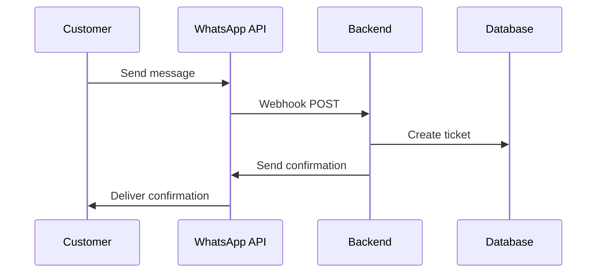
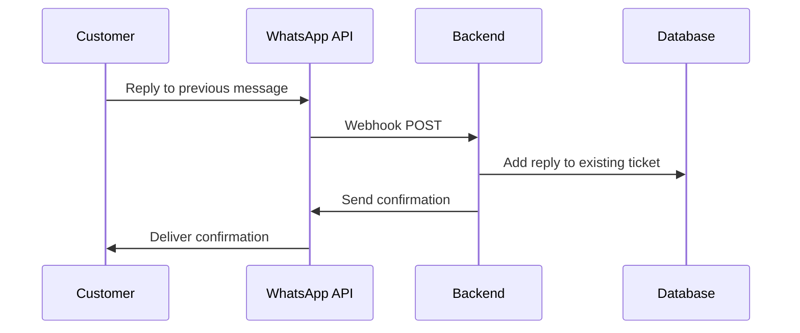
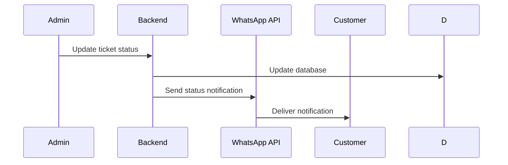

# WhatsApp Integration Guide
## Tick System - Complete WhatsApp Integration

---

## üìã Table of Contents
1. [Overview](#overview)
2. [Features](#features)
3. [Setup Instructions](#setup-instructions)
4. [API Endpoints](#api-endpoints)
5. [User Flows](#user-flows)
6. [Configuration](#configuration)
7. [Testing](#testing)
8. [Troubleshooting](#troubleshooting)

---

## 🎯 Overview

The WhatsApp integration allows customers to:
- **Create tickets** by sending WhatsApp messages
- **Receive notifications** when their tickets are updated
- **Reply to tickets** via WhatsApp messages
- **Get status updates** automatically

Support agents can:
- **Send notifications** to customers via WhatsApp
- **Test the integration** from the admin panel
- **Monitor WhatsApp status** in real-time

---

## ‚ú® Features

### Customer Features
- **WhatsApp Ticket Creation**: Send a message to create a ticket automatically
- **Real-time Notifications**: Get notified when ticket status changes
- **Reply Integration**: Reply to WhatsApp messages to add to existing tickets
- **Status Updates**: Receive notifications when tickets are updated

### Admin Features
- **WhatsApp Configuration**: Easy setup through admin panel
- **Test Messages**: Send test messages to verify integration
- **Status Monitoring**: Check WhatsApp connection status
- **Notification Management**: Control when notifications are sent

### Technical Features
- **Webhook Processing**: Handle incoming WhatsApp messages
- **Message Parsing**: Extract ticket information from messages
- **Error Handling**: Graceful handling of WhatsApp API errors
- **Database Integration**: Store WhatsApp data with tickets

---

## üöÄ Setup Instructions

### Step 1: Create WhatsApp Business Account

1. **Go to Meta Developer Console**
   - Visit [developers.facebook.com](https://developers.facebook.com)
   - Create a new app or use existing one
   - Add "WhatsApp Business API" product

2. **Configure WhatsApp Business API**
   - Go to WhatsApp > Getting Started
   - Add a phone number
   - Note down the **Phone Number ID**

### Step 2: Generate Access Token

1. **Create System User**
   - Go to Business Settings > System Users
   - Create a new system user
   - Assign WhatsApp permissions

2. **Generate Token**
   - Generate a permanent access token
   - Save this token securely

### Step 3: Configure Webhook

1. **Set Webhook URL**
   ```
   https://yourdomain.com/api/whatsapp/webhook
   ```

2. **Set Verify Token**
   - Choose a verify token (optional but recommended)
   - Use this token in your environment variables

3. **Subscribe to Events**
   - `messages` - for incoming messages
   - `message_deliveries` - for delivery confirmations

### Step 4: Environment Variables

Add these to your `backend/config.env`:

```env
# WhatsApp Business API Configuration
WHATSAPP_API_URL=https://graph.facebook.com/v18.0
WHATSAPP_PHONE_NUMBER_ID=540851035772644
WHATSAPP_ACCESS_TOKEN=your_acceEAAZAFlVKZBf1EBPEs4HcsOB0o7hjDO8AaZATyBdXcrly9zwVt6Sg23f9zszbxC5TgBPqIOSAFZAmzPYblcnvq4Xm4LHuKQC4U6TGkEaMmLSQLbluprwZAeY00KolbziqRRBdIrckqnfiZBoRXup9L7A02iYp9s8CvGzMjwAMgFjnvQecXlbZBqM3CmEPyZBBJ0uDqTwKnUehUVdZBBgEEZCDZBsyJ34taJNctWoJ4bIYHAQvWIZDss_token_here
WHATSAPP_VERIFY_TOKEN=my_verify_token_123
```

### Step 5: Test Integration

1. **Start your server**
   ```bash
   cd backend
   npm start
   ```

2. **Access admin panel**
   - Go to WhatsApp Configuration
   - Test the connection
   - Send a test message

---

## üîå API Endpoints

### WhatsApp Routes

| Method | Endpoint | Description |
|--------|----------|-------------|
| `GET` | `/api/whatsapp/webhook` | Webhook verification |
| `POST` | `/api/whatsapp/webhook` | Handle incoming messages |
| `POST` | `/api/whatsapp/send` | Send WhatsApp message |
| `GET` | `/api/whatsapp/status` | Check service status |
| `GET` | `/api/whatsapp/qr` | Generate QR code |

### Enhanced Ticket Routes

| Method | Endpoint | WhatsApp Integration |
|--------|----------|---------------------|
| `POST` | `/api/tickets` | ‚úÖ Sends creation notification |
| `PUT` | `/api/tickets/:id/status` | ‚úÖ Sends status update |
| `GET` | `/api/tickets` | ‚úÖ Includes WhatsApp fields |

### Enhanced Reply Routes

| Method | Endpoint | WhatsApp Integration |
|--------|----------|---------------------|
| `POST` | `/api/replies` | ‚úÖ Sends reply notification |
| `GET` | `/api/replies/:ticketId` | ‚úÖ Includes WhatsApp data |

---

## 🔄 User Flows

### Flow 1: Customer Creates Ticket via WhatsApp



**Steps:**
1. Customer sends WhatsApp message
2. Webhook receives message
3. System creates ticket automatically
4. Customer receives confirmation
5. Admin sees new ticket in dashboard

### Flow 2: Customer Replies to Ticket



**Steps:**
1. Customer replies to previous WhatsApp message
2. System finds existing ticket for that phone number
3. Adds reply to existing ticket
4. Customer receives confirmation
5. Admin sees new reply in ticket

### Flow 3: Admin Updates Ticket Status



**Steps:**
1. Admin updates ticket status in dashboard
2. System sends WhatsApp notification
3. Customer receives status update
4. Customer can reply if needed

---

## ⚙️ Configuration

### Environment Variables

```env
# Required
WHATSAPP_PHONE_NUMBER_ID=123456789012345
WHATSAPP_ACCESS_TOKEN=your_permanent_access_token

# Optional
WHATSAPP_API_URL=https://graph.facebook.com/v18.0
WHATSAPP_VERIFY_TOKEN=your_verify_token
```

### Database Schema

The system uses existing tables with WhatsApp fields:

```sql
-- Tickets table (existing with WhatsApp fields)
CREATE TABLE tickets (
  id INT AUTO_INCREMENT PRIMARY KEY,
  name VARCHAR(30) NOT NULL,
  email VARCHAR(100) NOT NULL,
  mobile VARCHAR(15),
  description TEXT NOT NULL,
  issue_type VARCHAR(50),
  issue_type_other VARCHAR(100),
  issue_title VARCHAR(150),
  attachment_name VARCHAR(255),
  attachment_type VARCHAR(50),
  attachment LONGBLOB,
  status ENUM('new','in_progress','closed') DEFAULT 'new',
  whatsapp_enabled BOOLEAN DEFAULT FALSE,
  whatsapp_notifications BOOLEAN DEFAULT TRUE,
  created_at DATETIME DEFAULT CURRENT_TIMESTAMP,
  updated_at DATETIME DEFAULT CURRENT_TIMESTAMP ON UPDATE CURRENT_TIMESTAMP
);
```

---

## üß™ Testing

### Test WhatsApp Integration

1. **Check Status**
   ```bash
   curl http://localhost:5000/api/whatsapp/status
   ```

2. **Send Test Message**
   ```bash
   curl -X POST http://localhost:5000/api/whatsapp/send \
     -H "Content-Type: application/json" \
     -d '{
       "phoneNumber": "+1234567890",
       "message": "Test message from Tick System"
     }'
   ```

3. **Test Webhook (Local)**
   - Use ngrok to expose local server
   - Set webhook URL to ngrok URL
   - Send WhatsApp message to test

### Test Ticket Creation

1. **Send WhatsApp Message**
   - Send any message to your WhatsApp number
   - System should create ticket automatically

2. **Check Database**
   ```sql
   SELECT * FROM tickets WHERE mobile = 'your_phone_number';
   ```

3. **Check Replies**
   ```sql
   SELECT * FROM replies WHERE ticket_id = (SELECT id FROM tickets WHERE mobile = 'your_phone_number' ORDER BY created_at DESC LIMIT 1);
   ```

---

## üîß Troubleshooting

### Common Issues

#### 1. Webhook Not Receiving Messages
**Symptoms:** Messages not creating tickets
**Solutions:**
- Check webhook URL is correct
- Verify webhook is subscribed to `messages` event
- Check server logs for webhook errors
- Ensure verify token matches

#### 2. WhatsApp API Errors
**Symptoms:** Cannot send messages
**Solutions:**
- Verify Phone Number ID is correct
- Check access token is valid and has permissions
- Ensure phone number is verified
- Check API rate limits

#### 3. Database Errors
**Symptoms:** Tickets not saving
**Solutions:**
- Check database connection
- Verify table schema is correct
- Check for SQL errors in logs

#### 4. Environment Variables
**Symptoms:** Service not configured
**Solutions:**
- Verify all environment variables are set
- Check file path for config.env
- Restart server after changing variables

### Debug Commands

```bash
# Check WhatsApp status
curl http://localhost:5000/api/whatsapp/status

# Test webhook locally
curl -X POST http://localhost:5000/api/whatsapp/webhook \
  -H "Content-Type: application/json" \
  -d '{"test": "data"}'

# Check server logs
tail -f backend/logs/app.log
```

### Log Locations

- **Backend logs:** `backend/logs/`
- **WhatsApp logs:** Check console output
- **Database logs:** MySQL error log

---

## üìû Support

For issues with this integration:

1. **Check the logs** for error messages
2. **Verify configuration** matches setup instructions
3. **Test with curl commands** to isolate issues
4. **Check WhatsApp Business API documentation**

### Useful Links

- [WhatsApp Business API Documentation](https://developers.facebook.com/docs/whatsapp)
- [Meta Developer Console](https://developers.facebook.com)
- [Webhook Setup Guide](https://developers.facebook.com/docs/whatsapp/webhook)

---

## üéâ Success!

Once configured, your Tick System will:

‚úÖ **Automatically create tickets** from WhatsApp messages  
‚úÖ **Send notifications** when tickets are updated  
‚úÖ **Allow customer replies** via WhatsApp  
‚úÖ **Provide admin tools** for testing and monitoring  

Your customers can now create and manage support tickets entirely through WhatsApp! 

---

## 1️⃣ **The Error Explained**

- **"The callback URL or verify token couldn't be validated."**
  - This means Meta tried to verify your webhook, but your backend didn’t respond with the expected value.
- **ValidationError: The 'X-Forwarded-For' header is set but the Express 'trust proxy' setting is false (default).**
  - This is because ngrok adds the `X-Forwarded-For` header, but Express doesn’t trust it by default.
  - This causes issues with rate limiting and sometimes with webhook verification.

---

## 2️⃣ **How to Fix**

### **A. Enable Trust Proxy in Express**

Open your `backend/server.js` and **add this line** near the top, right after you create your `app`:

```js
const app = express();
app.set('trust proxy', 1); // <-- Add this line
```

This tells Express to trust the `X-Forwarded-For` header from ngrok and other proxies.

---

### **B. Double-Check Your Verify Token**

- Make sure the **verify token** in your Meta Developer Console **matches exactly** what you have in your `config.env` (`WHATSAPP_VERIFY_TOKEN`).
- No extra spaces, no typos.

---

### **C. Restart Your Backend**

After making the change, restart your backend server:

```bash
cd backend
npm start
```

---

### **D. Try Webhook Verification Again**

- Go back to the Meta Developer Console and try to verify the webhook again.
- If you get another error, let me know the exact message.

---

## 3️⃣ **Summary of What to Do**

1. **Edit `backend/server.js`:**
   ```js
   const app = express();
   app.set('trust proxy', 1); // Add this line
   ```
2. **Restart your backend server**
3. **Retry webhook verification in Meta Developer Console**

---

**This should fix the error!**  
If you still have issues, please copy the new error message here and I’ll help you further.  
Let me know once you’ve made the change or if you need help editing the file! 

Thank you for testing with curl and sharing the result:

```
{"success":false,"message":"Webhook verification failed"}
```

This means your webhook handler is being called, but the **verify token or mode is not matching** what your backend expects.

Let's fix this step by step:

---

## 1️⃣ **Check What Token Your Backend Is Actually Using**

**Add a log in your `backend/services/whatsapp.js` constructor:**

```js
constructor() {
  this.apiUrl = process.env.WHATSAPP_API_URL || 'https://graph.facebook.com/v18.0';
  this.phoneNumberId = process.env.WHATSAPP_PHONE_NUMBER_ID;
  this.accessToken = process.env.WHATSAPP_ACCESS_TOKEN;
  this.verifyToken = process.env.WHATSAPP_VERIFY_TOKEN || 'your_verify_token_here';
  console.log('Loaded verify token:', this.verifyToken); // <-- Add this line
}
```

**Restart your backend and check the console.**  
It should print:
```
Loaded verify token: my_verify_token_123
```
If it prints something else, your environment variable is not being loaded correctly.

---

## 2️⃣ **Check Your .env File for Typos or Spaces**

- Open `backend/config.env`
- Make sure the line is **exactly**:
  ```
  WHATSAPP_VERIFY_TOKEN=my_verify_token_123
  ```
- No spaces before or after the `=`
- No quotes around the value

---

## 3️⃣ **Check Your Webhook Handler Logic**

In `backend/services/whatsapp.js`, your function should be:

```js
<code_block_to_apply_changes_from>
```

---

## 4️⃣ **Try the Manual Curl Again**

After confirming the above, run:

```bash
curl "https://3288c4893c82.ngrok-free.app/api/whatsapp/webhook?hub.mode=subscribe&hub.verify_token=my_verify_token_123&hub.challenge=test_challenge"
```

You **should** get:
```
test_challenge
```
If you still get `Webhook verification failed`, copy the **console output** (especially the `Loaded verify token:` line) and paste it here.

---

## 5️⃣ **If It Still Fails**

- Double-check that you are editing the correct `config.env` in the `backend` folder.
- Make sure you are restarting the backend after every change.
- If you are using VS Code or another editor, make sure it is saving the file (no unsaved changes).

---

## 6️⃣ **Summary Checklist**

- [ ] Console prints `Loaded verify token: my_verify_token_123`
- [ ] `config.env` has `WHATSAPP_VERIFY_TOKEN=my_verify_token_123`
- [ ] Manual curl returns `test_challenge`

---

**Please do these steps and paste the console output (especially the loaded verify token) here. This will help us solve the problem for good!** 

Thank you for confirming the result. Since you are still getting:
```
{"success":false,"message":"Webhook verification failed"}
```
let’s **diagnose exactly what’s happening**. Please follow these steps carefully:

---

## 1️⃣ **Add a Debug Log for the Verify Token**

**In `backend/services/whatsapp.js`, update your `verifyWebhook` function to log the incoming values:**

```js
<code_block_to_apply_changes_from>
```

**Also, make sure your constructor logs the loaded token:**
```js
constructor() {
  this.apiUrl = process.env.WHATSAPP_API_URL || 'https://graph.facebook.com/v18.0';
  this.phoneNumberId = process.env.WHATSAPP_PHONE_NUMBER_ID;
  this.accessToken = process.env.WHATSAPP_ACCESS_TOKEN;
  this.verifyToken = process.env.WHATSAPP_VERIFY_TOKEN || 'your_verify_token_here';
  console.log('Loaded verify token:', this.verifyToken);
}
```

---

## 2️⃣ **Restart Your Backend**

After saving the changes, restart your backend server:
```bash
cd backend
npm start
```

---

## 3️⃣ **Run the Manual Curl Test Again

```
