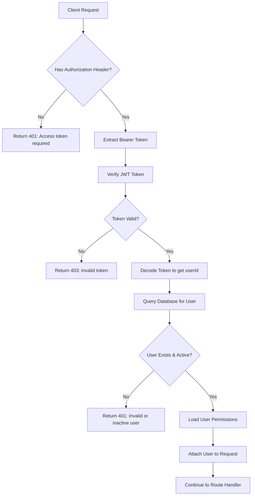
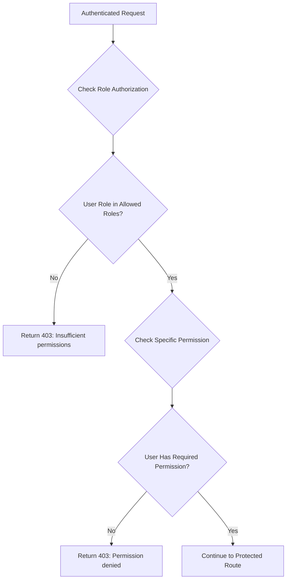
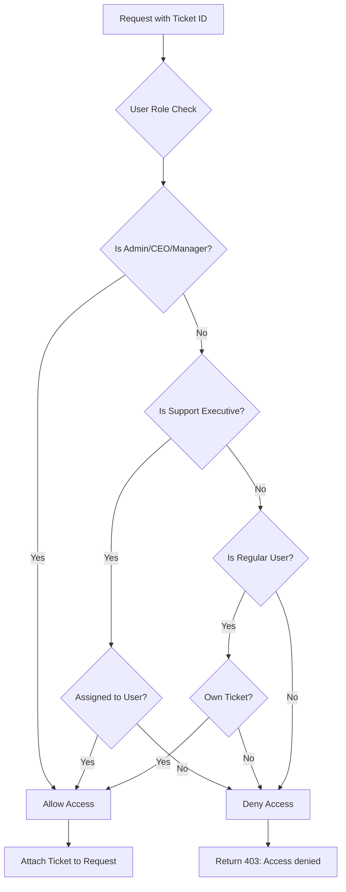
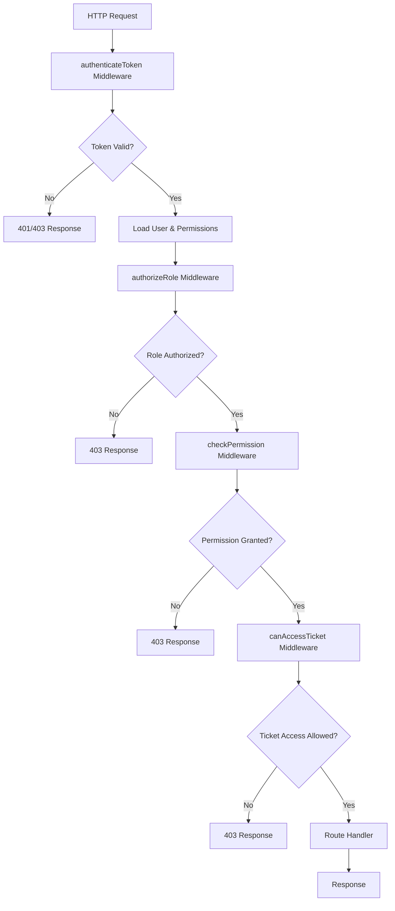
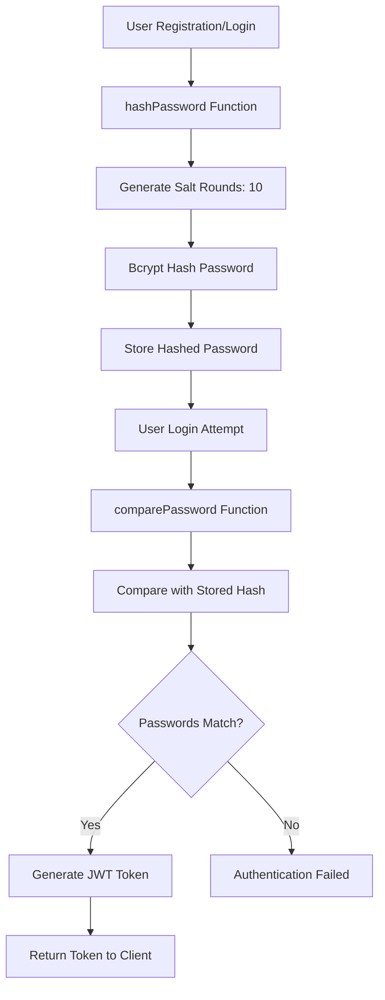

# Authentication & Authorization Flow Diagram

## System Overview
This document outlines the complete authentication and authorization flow for the ITSM system, based on the middleware implementation in `backend/middleware/auth.js`.

## 1. Permission Matrix

```
┌─────────────────┬─────────────────────────────────────────────────────────────┐
│ Role            │ Permissions                                               │
├─────────────────┼─────────────────────────────────────────────────────────────┤
│ user            │ • create_ticket                                           │
│                 │ • view_own_tickets                                        │
│                 │ • rate_support                                            │
│                 │ • whatsapp_chat                                           │
├─────────────────┼─────────────────────────────────────────────────────────────┤
│ support_executive│ • view_assigned_tickets                                  │
│                 │ • reply_to_tickets                                        │
│                 │ • update_ticket_status                                    │
│                 │ • send_whatsapp_notifications                             │
│                 │ • view_customer_history                                   │
├─────────────────┼─────────────────────────────────────────────────────────────┤
│ support_manager │ • view_all_tickets                                        │
│                 │ • assign_tickets                                          │
│                 │ • rate_performance                                        │
│                 │ • view_analytics                                          │
│                 │ • generate_reports                                        │
│                 │ • escalate_tickets                                        │
├─────────────────┼─────────────────────────────────────────────────────────────┤
│ ceo             │ • view_all_data                                           │
│                 │ • view_analytics                                          │
│                 │ • view_reports                                            │
│                 │ • view_business_intelligence                              │
├─────────────────┼─────────────────────────────────────────────────────────────┤
│ admin           │ • all_permissions                                         │
│                 │ • manage_users                                            │
│                 │ • system_configuration                                    │
│                 │ • database_management                                     │
└─────────────────┴─────────────────────────────────────────────────────────────┘
```

## 2. Authentication Flow



## 3. Authorization Flow



## 4. Ticket Access Control Flow



## 5. Complete Request Flow



## 6. Password Security Flow



## 7. JWT Token Structure

```
┌─────────────────────────────────────────────────────────────────────────────┐
│ JWT Token Payload                                                         │
├─────────────────────────────────────────────────────────────────────────────┤
│ {                                                                         │
│   "userId": "123",                                                        │
│   "email": "user@example.com",                                           │
│   "role": "support_executive",                                            │
│   "department": "IT",                                                     │
│   "managerId": "456"                                                      │
│ }                                                                         │
├─────────────────────────────────────────────────────────────────────────────┤
│ Expiration: 24 hours                                                     │
│ Algorithm: HMAC SHA256                                                   │
│ Secret: JWT_SECRET environment variable                                  │
└─────────────────────────────────────────────────────────────────────────────┘
```

## 8. Error Response Patterns

```
┌─────────────────┬─────────────────┬─────────────────────────────────────────┐
│ HTTP Status     │ Error Type      │ Response Message                       │
├─────────────────┼─────────────────┼─────────────────────────────────────────┤
│ 401             │ No Token        │ "Access token required"                │
│ 401             │ Invalid User    │ "Invalid or inactive user"             │
│ 401             │ Auth Required   │ "Authentication required"               │
│ 403             │ Invalid Token   │ "Invalid token"                        │
│ 403             │ Role Denied     │ "Insufficient permissions"             │
│ 403             │ Permission Denied│ "Permission denied"                   │
│ 403             │ Ticket Access   │ "Access denied to this ticket"         │
│ 404             │ Ticket Not Found│ "Ticket not found"                     │
│ 500             │ Server Error    │ "Error checking ticket access"         │
└─────────────────┴─────────────────┴─────────────────────────────────────────┘
```

## 9. Middleware Usage Examples

### Route Protection Examples

```javascript
// Basic authentication
app.get('/protected', authenticateToken, (req, res) => {
  res.json({ message: 'Protected route' });
});

// Role-based authorization
app.get('/admin', authenticateToken, authorizeRole(['admin', 'ceo']), (req, res) => {
  res.json({ message: 'Admin only' });
});

// Permission-based authorization
app.post('/tickets', authenticateToken, checkPermission('create_ticket'), (req, res) => {
  res.json({ message: 'Ticket created' });
});

// Ticket access control
app.get('/tickets/:id', authenticateToken, canAccessTicket, (req, res) => {
  res.json({ ticket: req.ticket });
});
```

## 10. Security Considerations

1. **Token Security**: JWT tokens expire after 24 hours
2. **Password Hashing**: Uses bcrypt with 10 salt rounds
3. **Role-based Access**: Granular permission system
4. **Ticket Isolation**: Users can only access their own tickets
5. **Database Validation**: All tokens validated against database
6. **Error Handling**: Comprehensive error responses without information leakage

## 11. Implementation Notes

- All middleware functions are asynchronous where database queries are involved
- User permissions are loaded once during authentication and cached in request object
- Ticket access control is performed on-demand for each ticket operation
- Password comparison uses constant-time comparison to prevent timing attacks
- JWT secret should be stored in environment variables for security 